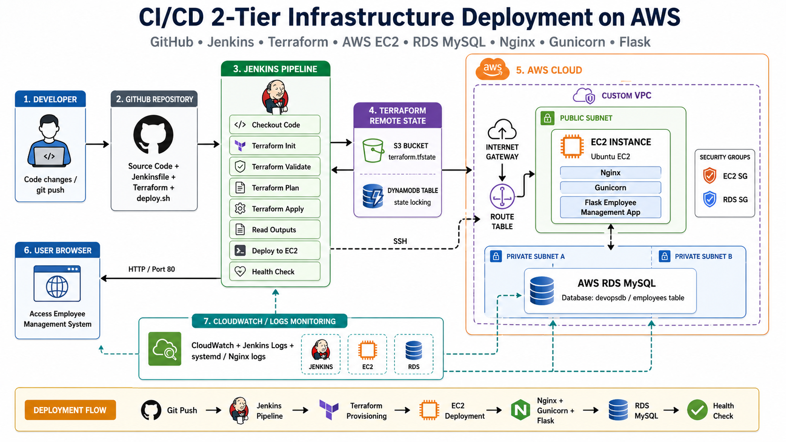

<h1 align="center">🚀 CI/CD 2-Tier Infrastructure Deployment</h1>

<p align="center">
  Automate • Provision • Deploy
</p>

<p align="center">
  An industry-style DevOps project using Jenkins, Terraform, GitHub, AWS EC2, RDS MySQL, Nginx, Gunicorn, and Flask.
</p>

---

# 🌐 Project Links

| Service | Link |
|---|---|
| GitHub Repository | https://github.com/praneshkA/devops-2tier-cicd |
| Application URL | http://YOUR_EC2_PUBLIC_IP |
| Jenkins Dashboard | http://localhost:8081 |
| AWS Region | ap-south-1 |

> Note: EC2 public IP changes whenever infrastructure is destroyed and recreated.

---

# 🏗️ Architecture Diagram

<p align="center">
  
</p>

---

# 📌 Project Overview

This project demonstrates a complete CI/CD workflow for deploying a 2-tier Employee Management System on AWS.

The infrastructure is created using Terraform. Jenkins pulls the code from GitHub, provisions AWS infrastructure, deploys the Flask application to EC2, configures Nginx and Gunicorn, connects the application to RDS MySQL, and performs a health check.

---

# 🧱 Architecture

```text
User Browser
     |
     v
EC2 Public IP - Port 80
     |
     v
Nginx Reverse Proxy
     |
     v
Gunicorn - Port 5000
     |
     v
Flask Employee Management App
     |
     v
AWS RDS MySQL
```

---

# ⚙️ CI/CD Flow

```text
Developer
   |
   | git push
   v
GitHub Repository
   |
   v
Jenkins Pipeline
   |
   | Terraform Init
   | Terraform Validate
   | Terraform Plan
   | Terraform Apply
   v
AWS Infrastructure
   |
   | SSH Deployment
   v
EC2 Instance
   |
   v
Nginx + Gunicorn + Flask
   |
   v
RDS MySQL
```

---

# ✨ Features

- 🌐 2-tier AWS architecture
- 🏗️ Infrastructure as Code using Terraform
- 🔁 Jenkins CI/CD pipeline
- 📦 GitHub-based source control
- 🖥️ EC2 web server deployment
- 🗄️ RDS MySQL database
- 🔐 Security groups for EC2 and RDS
- 🌍 Nginx reverse proxy on port 80
- 🐍 Flask Employee Management System
- 🚀 Gunicorn production server
- 📁 Terraform remote state using S3
- 🔒 Terraform state locking using DynamoDB
- 📊 Basic monitoring using CloudWatch, Jenkins logs, systemd logs, and Nginx logs

---

# 🛠️ Tech Stack

## DevOps Tools

- Jenkins
- Terraform
- Git
- GitHub
- AWS CLI

## AWS Services

- EC2
- RDS MySQL
- VPC
- Subnets
- Internet Gateway
- Route Tables
- Security Groups
- S3
- DynamoDB
- CloudWatch

## Application Stack

- Python
- Flask
- PyMySQL
- Gunicorn
- Nginx
- MySQL

---

# 📂 Folder Structure

```text
devops-2tier-cicd
│
├── app
│   ├── app.py
│   ├── requirements.txt
│   └── .env.example
│
├── terraform
│   ├── provider.tf
│   ├── main.tf
│   ├── variables.tf
│   └── outputs.tf
│
├── scripts
│   └── deploy.sh
│
├── jenkins
│   └── Jenkinsfile
│
├── assets
│   └── architecture.png
│
├── docs
│
├── .gitignore
└── README.md
```

---

# 🏗️ Infrastructure Created

Terraform provisions the following AWS resources:

- Custom VPC
- Public subnet
- Private subnet 1
- Private subnet 2
- Internet Gateway
- Route Table
- Route Table Association
- EC2 Security Group
- RDS Security Group
- EC2 Key Pair
- EC2 Instance
- RDS Subnet Group
- RDS MySQL Database

---

# 🧑‍💼 Application Features

The Employee Management System supports:

- Add employee
- View employees
- Delete employee
- Store employee details in AWS RDS MySQL

Database table:

```sql
CREATE TABLE employees (
    id INT AUTO_INCREMENT PRIMARY KEY,
    name VARCHAR(100) NOT NULL,
    email VARCHAR(100) NOT NULL UNIQUE,
    department VARCHAR(100) NOT NULL,
    created_at TIMESTAMP DEFAULT CURRENT_TIMESTAMP
);
```

---

# 🔁 Jenkins Pipeline Stages

```text
Clean Workspace
Checkout Code
Terraform Init
Terraform Validate
Terraform Plan
Terraform Apply
Read Terraform Outputs
Deploy Application to EC2
Health Check
```

---

# 🔐 Jenkins Credentials

The following credentials are stored securely in Jenkins:

| Credential ID | Purpose |
|---|---|
| aws-access-key-id | AWS Access Key |
| aws-secret-access-key | AWS Secret Key |
| ec2-ssh-key | SSH access to EC2 |
| db-user | RDS username |
| db-password | RDS password |

Secrets are not stored in GitHub.

---

# 🚀 Deployment Script

The `scripts/deploy.sh` script automates:

- Ubuntu package update
- Git installation
- Python virtual environment setup
- Python dependency installation
- MySQL table creation
- Gunicorn service creation
- Nginx reverse proxy configuration
- Application restart
- Health check

---

# 📦 Setup Instructions

## 1️⃣ Clone Repository

```bash
git clone https://github.com/praneshkA/devops-2tier-cicd.git
```

---

## 2️⃣ Navigate to Project

```bash
cd devops-2tier-cicd
```

---

# ☁️ Terraform Setup

## 3️⃣ Navigate to Terraform Folder

```bash
cd terraform
```

---

## 4️⃣ Initialize Terraform

```bash
terraform init
```

---

## 5️⃣ Validate Terraform

```bash
terraform validate
```

---

## 6️⃣ View Terraform Plan

```bash
terraform plan
```

---

## 7️⃣ Apply Infrastructure

```bash
terraform apply
```

Type:

```text
yes
```

---

## 8️⃣ Check Outputs

```bash
terraform output
```

Expected outputs:

```text
ec2_public_ip
rds_endpoint
ec2_instance_id
rds_identifier
```

---

# ⚙️ Jenkins Setup

## 1️⃣ Open Jenkins

```text
http://localhost:8081
```

---

## 2️⃣ Required Jenkins Plugins

- Git
- GitHub
- Pipeline
- SSH Agent
- Credentials Binding
- Workspace Cleanup

---

## 3️⃣ Create Jenkins Pipeline Job

Job type:

```text
Pipeline
```

Pipeline definition:

```text
Pipeline script from SCM
```

SCM:

```text
Git
```

Repository URL:

```text
https://github.com/praneshkA/devops-2tier-cicd.git
```

Branch:

```text
*/main
```

Script path:

```text
jenkins/Jenkinsfile
```

---

# 🌐 Access Application

After successful Jenkins deployment, open:

```text
http://EC2_PUBLIC_IP/
```

Example:

```text
http://3.108.61.216/
```

---

# 🧪 Testing

## Application Testing

- Open application in browser
- Add employee
- View employee in table
- Delete employee
- Verify database update

---

## Server Testing

```bash
sudo systemctl status employee-app --no-pager
sudo systemctl status nginx --no-pager
curl http://127.0.0.1
curl http://127.0.0.1:5000
```

Expected result:

```text
Employee Management System
```

---

## Database Testing

```bash
mysql -h <rds-endpoint> -P 3306 -u admin -p
```

```sql
USE devopsdb;
SHOW TABLES;
SELECT * FROM employees;
```

---

## Jenkins Testing

Check Jenkins console output and verify all stages are successful:

```text
Checkout Code
Terraform Init
Terraform Validate
Terraform Plan
Terraform Apply
Deploy Application to EC2
Health Check
```

---

# 📊 Monitoring

Basic monitoring is done using:

- AWS CloudWatch EC2 metrics
- AWS CloudWatch RDS metrics
- Jenkins build logs
- Linux systemd logs
- Nginx access logs
- Nginx error logs

Useful commands:

```bash
sudo journalctl -u employee-app -n 50 --no-pager
sudo tail -n 30 /var/log/nginx/access.log
sudo tail -n 30 /var/log/nginx/error.log
```

---

# 🔒 Security Practices

- RDS is deployed in private subnets
- RDS is not publicly accessible
- EC2 is deployed in a public subnet
- RDS allows MySQL access only from EC2 security group
- Secrets are stored in Jenkins Credentials
- Terraform state is stored in S3 remote backend
- Terraform state locking is handled by DynamoDB
- SSH private keys are excluded using `.gitignore`
- `.env` files are not pushed to GitHub

---

# 🧹 Cost Management

To avoid AWS charges after practice:

```bash
cd terraform
terraform destroy
```

Type:

```text
yes
```

Do not delete the S3 backend bucket and DynamoDB lock table unless the project is fully completed.

---

# 🧠 Development Workflow

## Phase 1 — Prerequisites

- AWS account
- IAM user
- AWS CLI
- Terraform
- Git
- Jenkins

## Phase 2 — GitHub Repository

- Folder structure
- Git setup
- GitHub push
- `.gitignore`

## Phase 3 — Terraform Infrastructure

- VPC
- Subnets
- Internet Gateway
- Route Table
- Security Groups
- EC2
- RDS

## Phase 4 — Application Deployment

- Flask app
- RDS connection
- Gunicorn
- Nginx
- systemd service

## Phase 5 — Jenkins CI/CD

- Jenkinsfile
- Credentials
- Terraform automation
- SSH deployment
- Health check

## Phase 6 — Testing

- Browser testing
- Database testing
- Service testing
- Jenkins testing

## Phase 7 — Monitoring

- CloudWatch metrics
- Jenkins logs
- systemd logs
- Nginx logs

## Phase 8 — Documentation

- README
- Architecture diagram
- Resume description
- Interview preparation

---

# ⚠️ Common Issues and Fixes

## Terraform backend initialization required

```bash
terraform init -reconfigure
```

or:

```bash
terraform init -migrate-state
```

---

## Jenkins cannot find Terraform

Add Terraform path to Windows System Environment Variables and restart Jenkins.

---

## Jenkins ssh-agent error

Run PowerShell as Administrator:

```powershell
Set-Service -Name ssh-agent -StartupType Automatic
Start-Service ssh-agent
Restart-Service Jenkins
```

---

## Website shows default Nginx page

Nginx reverse proxy is not configured correctly.

Check:

```bash
sudo nginx -t
sudo systemctl restart nginx
```

---

## Flask app not running

```bash
sudo systemctl status employee-app --no-pager
sudo journalctl -u employee-app -n 50 --no-pager
```

---

## RDS table missing

The deployment script creates the table automatically using:

```sql
CREATE TABLE IF NOT EXISTS employees;
```

---

# ✅ Final Outcome

This project successfully demonstrates:

- AWS 2-tier architecture
- Infrastructure as Code using Terraform
- Automated CI/CD using Jenkins
- GitHub-based source control
- EC2 application deployment
- RDS MySQL database integration
- Nginx reverse proxy setup
- Gunicorn production server
- Remote Terraform state management
- Basic monitoring and troubleshooting

---


# 🚀 Future Improvements

- Add HTTPS using SSL certificate
- Use AWS Secrets Manager for database credentials
- Add Docker support
- Add automated unit tests
- Add GitHub webhook
- Add CloudWatch alarms
- Add SNS notification for Jenkins failures
- Add Application Load Balancer
- Add Auto Scaling Group
- Use least-privilege IAM policy instead of AdministratorAccess

---

# 👨‍💻 Author

Developed by Pranesh